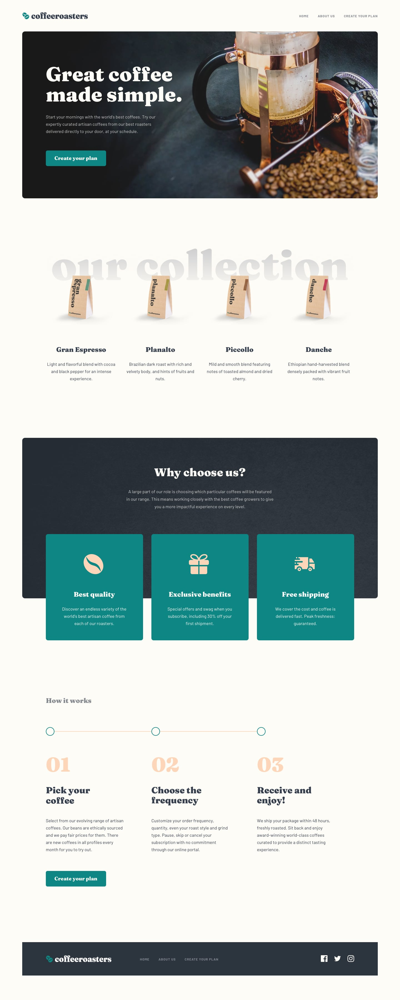

# Frontend Mentor - Coffeeroasters subscription site solution

This is a solution to the [Coffeeroasters subscription site challenge on Frontend Mentor](https://www.frontendmentor.io/challenges/coffeeroasters-subscription-site-5Fc26HVY6). Frontend Mentor challenges help you improve your coding skills by building realistic projects.

## Table of contents

- [Overview](#overview)
  - [The challenge](#the-challenge)
  - [Screenshot](#screenshot)
  - [Links](#links)
- [My process](#my-process)
  - [Built with](#built-with)
  - [What I learned](#what-i-learned)
  - [Continued development](#continued-development)
- [Author](#author)

## Overview

### The challenge

Users should be able to:

- View the optimal layout for each page depending on their device's screen size
- See hover states for all interactive elements throughout the site
- Make selections to create a coffee subscription and see an order summary modal of their choices

### Screenshot

### Links

- Solution URL: [Click here](https://github.com/elasri21/coffeeroasters)
- Live Site URL: [Click here](https://elasri21.github.io/coffeeroasters/)

## My process

### Built with

- Semantic HTML5 markup
- Sass
- Flexbox
- CSS Grid
- JavaScript

## Author

- linkedin - [Elasri Mohamed](https://www.linkedin.com/in/mohamed-elasri-a4ab8815a/)
   
- Github - [elasri21](https://github.com/elasri21)
   
- Frontend Mentor - [elasri21](https://www.frontendmentor.io/profile/elasri21)
   
- instagram - [@simo5904](https://www.instagram.com/simo5904/)
   
- Twitter - [Elasri Mohamed](https://x.com/ELASRI08455745)
   
- Facebook - [Elasri Mohamed](https://web.facebook.com/simo.asri.378)
   
